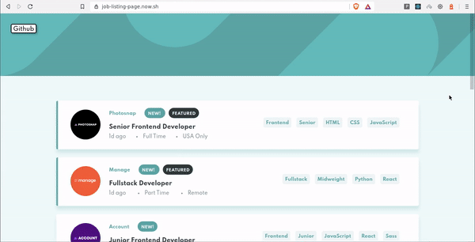
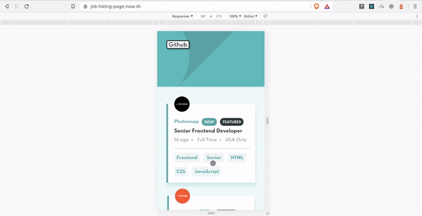

<!-- TABLE OF CONTENTS -->

## Table of Contents 📋 

- [About the Project](#about-the-project-eyes)
  - [Built With](#built-with-hammer)
- [Getting Started](#getting-started-)
  - [Prerequisites](#prerequisites-)
  - [Installation](#installation-arrow_down)
- [Usage](#usage-dart)
- [Contributing](#contributing-)
- [License](#license-)
- [Authors](#authors-closed_book)
- [Acknowledgements](#acknowledgements-checkered_flag)

<!-- ABOUT THE PROJECT -->

## About The Project :eyes: 

This is my Solution for Frontend Mentors' Challenge.

<p align="center">

  
<br >
<br/>


</p>

### Built With :hammer:

- [React](https://reactjs.com) - A JS library for building user interfaces
- [SCSS](https://sass-lang.com) - CSS with superpowers
- [React-Beautiful-Dnd](https://github.com/atlassian/react-beautiful-dnd) - Beautiful and accessible drag and drop for lists with React
- [Node-sass](https://github.com/sass/node-sass) - Node.js bindings to libsass
- [Classnames](https://www.npmjs.com/package/classnames) - A simple JavaScript utility for conditionally joining classNames together

<!-- GETTING STARTED -->

## Getting Started 🚀 

To get a local copy up and running follow these simple example steps.

### Prerequisites 💻 

- Node ([Download here!](https://nodejs.org/en/download))

### Installation :arrow_down: 

**1.** Fork [this](https://github.com/aman-atg/react-product-card) repository :fork_and_knife:

**2.** Clone your forked repository to your local system :busts_in_silhouette:

```sh
git clone https://github.com/<your-username>/react-product-card.git
```

Or Download and extract the zip file.

### Running

**1.** Install NPM packages :arrow_down:

```sh
npm install
```

**2.** Run! :running_man:

```sh
npm start
```

<!-- USAGE EXAMPLES -->

## Usage :dart: 

- Explore this Project to see how easily you can implement **_Drag and Drop_** Feature with [React-Beautiful-Dnd](https://github.com/atlassian/react-beautiful-dnd) for your next project.
- Handle Stylesheets using **_ITCSS Architecture_**.

<!-- CONTRIBUTING -->

## Contributing 🤝 

Any contributions you make are **greatly appreciated**.

1. Create your Branch (`git checkout -b master/test-branch`)
2. Commit your Changes (`git commit -m 'Add some code'`)
3. Push to the Branch (`git push origin master/test-branch`)
4. Open a Pull Request

<!-- LICENSE -->

## License 📝 

Distributed under the MIT License. See [`LICENSE`][license-url] for more information.

<!-- CONTACT -->

## Authors :closed_book: 

- [Aman Ansari](https://github.com/aman-atg)

<!-- ACKNOWLEDGEMENTS -->

## Acknowledgements :checkered_flag: 

- [UXwing](https://uxwing.com)
- [Frontend Mentors](http://frontendmentor.io)
- [Challenge Link](https://www.frontendmentor.io/challenges/job-listings-with-filtering-ivstIPCt)
- [My Solution](https://www.frontendmentor.io/solutions/animated-job-listing-site-with-drag-and-drop-react-scss-lCamCeYXR)

  <!-- MARKDOWN LINKS & IMAGES -->

[forks-shield]: https://img.shields.io/github/forks/aman-atg/Job-Listing-Demo-Site.svg?style=flat-square
[forks-url]: https://github.com/aman-atg/Job-Listing-Demo-Site/network/members
[stars-shield]: https://img.shields.io/github/stars/aman-atg/Job-Listing-Demo-Site.svg?style=flat-square
[stars-url]: https://github.com/aman-atg/Job-Listing-Demo-Site/stargazers
[issues-shield]: https://img.shields.io/github/issues/aman-atg/Job-Listing-Demo-Site.svg?style=flat-square
[issues-url]: https://github.com/aman-atg/Job-Listing-Demo-Site/issues
[license-shield]: https://img.shields.io/github/license/aman-atg/Job-Listing-Demo-Site.svg?style=flat-square
[license-url]: https://github.com/aman-atg/Job-Listing-Site/blob/master/LICENSE
